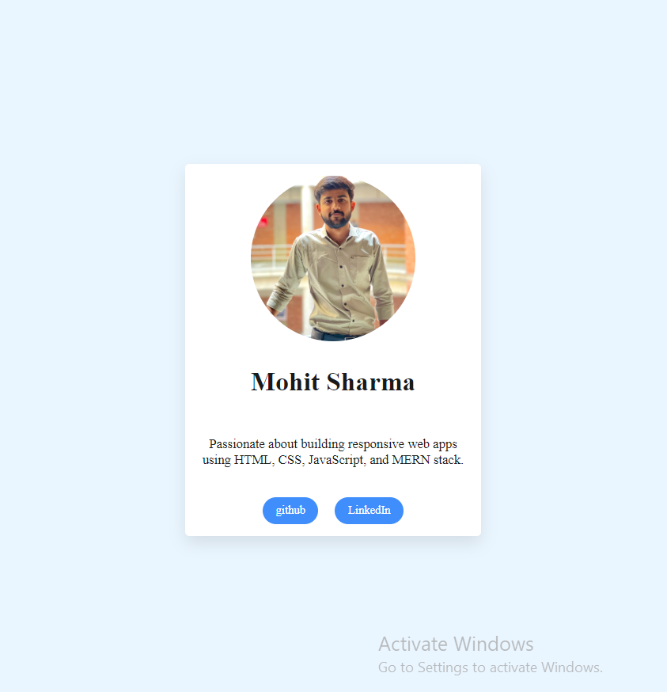

# Week 1 - Day 1: Profile Card Project

## Overview
This is my Day 1 project focused on practicing HTML and CSS fundamentals by creating a simple, clean **Profile Card** webpage.

The profile card includes:
- A circular profile image
- Name heading
- A short description paragraph
- Links to my GitHub and LinkedIn profiles styled as buttons

## What I Learned
- Structuring HTML with semantic tags
- Linking external CSS and separating style from markup
- Using Flexbox to center content vertically and horizontally
- Styling images as circles with `border-radius`
- Applying box-shadow and border-radius to containers for modern UI
- Creating interactive button styles with hover effects
- Using relative paths for local assets and meaningful alt text for accessibility
- Best practices for external links with `target="_blank"` and `rel="noopener noreferrer"`

## Project Files
| File         | Description                            |
|--------------|------------------------------------|
| `index.html` | HTML markup for the profile card       |
| `styles.css` | CSS styles for layout and design        |
| `profile.jpg`| Circular profile image used in the card |

## How to Run
Open `index.html` in any modern web browser to view the profile card.

## Notes
- The image file is named `profile.jpg` and stored in the same folder for easy relative linking.
- External links open in new tabs for better user experience and security.

*This project represents the first step in my web development learning curve. Excited to keep building more complex projects!*
