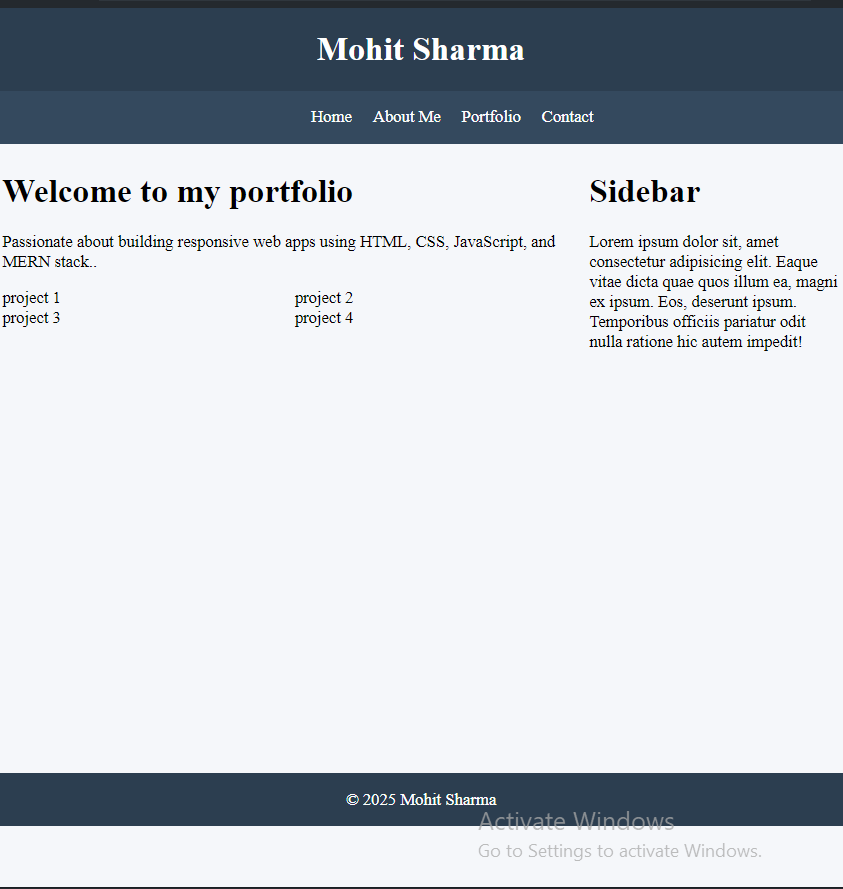

# Week 1 - Day 2: Responsive Layout Practice

This project practices building a responsive webpage layout using HTML and CSS.  
The layout includes a header, navigation bar, main content area with a project grid, sidebar, and footer.

## Features

- Responsive flexbox layout with sidebar  
- CSS Grid for project cards  
- Media queries for different screen sizes  
- Basic styling with improved colors and spacing  
- Navigation menu with hover effect on the entire nav bar  

## File Structure

- `index.html` — Main HTML file with semantic layout elements  
- `style.css` — Styles for layout, grid, responsiveness, and colors  

### How to run

Simply open `index.html` in any modern browser.

